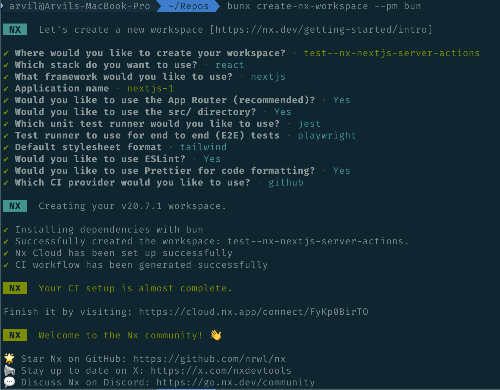

# Setup

```
 arvil@Arvils-MacBook-Pro  ~/Repos  bunx create-nx-workspace --pm bun

 NX   Let's create a new workspace [https://nx.dev/getting-started/intro]

✔ Where would you like to create your workspace? · test--nx-nextjs-server-actions
✔ Which stack do you want to use? · react
✔ What framework would you like to use? · nextjs
✔ Application name · nextjs-1
✔ Would you like to use the App Router (recommended)? · Yes
✔ Would you like to use the src/ directory? · Yes
✔ Which unit test runner would you like to use? · jest
✔ Test runner to use for end to end (E2E) tests · playwright
✔ Default stylesheet format · tailwind
✔ Would you like to use ESLint? · Yes
✔ Would you like to use Prettier for code formatting? · Yes
✔ Which CI provider would you like to use? · github

 NX   Creating your v20.7.1 workspace.

✔ Installing dependencies with bun
✔ Successfully created the workspace: test--nx-nextjs-server-actions.
✔ Nx Cloud has been set up successfully
✔ CI workflow has been generated successfully

 NX   Your CI setup is almost complete.

Finish it by visiting: https://cloud.nx.app/connect/FyKp0BirTO

 NX   Welcome to the Nx community! 👋

🌟 Star Nx on GitHub: https://github.com/nrwl/nx
📢 Stay up to date on X: https://x.com/nxdevtools
💬 Discuss Nx on Discord: https://go.nx.dev/community
```


